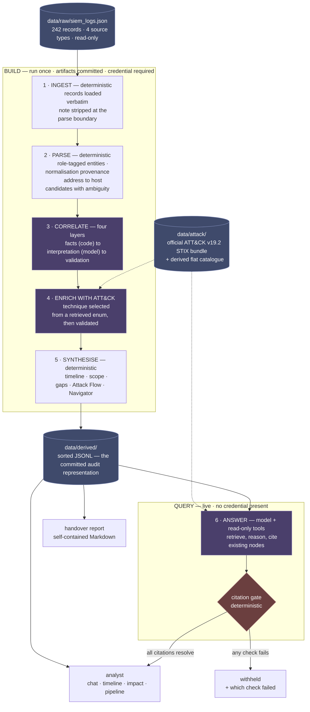
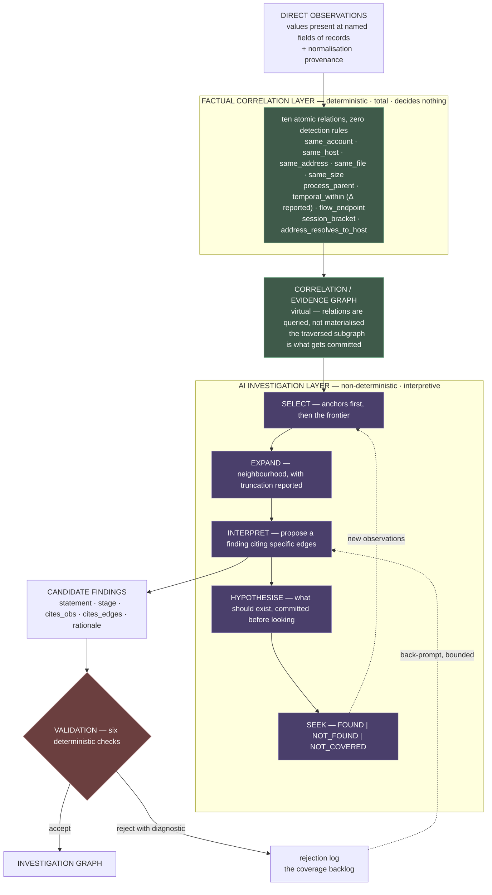
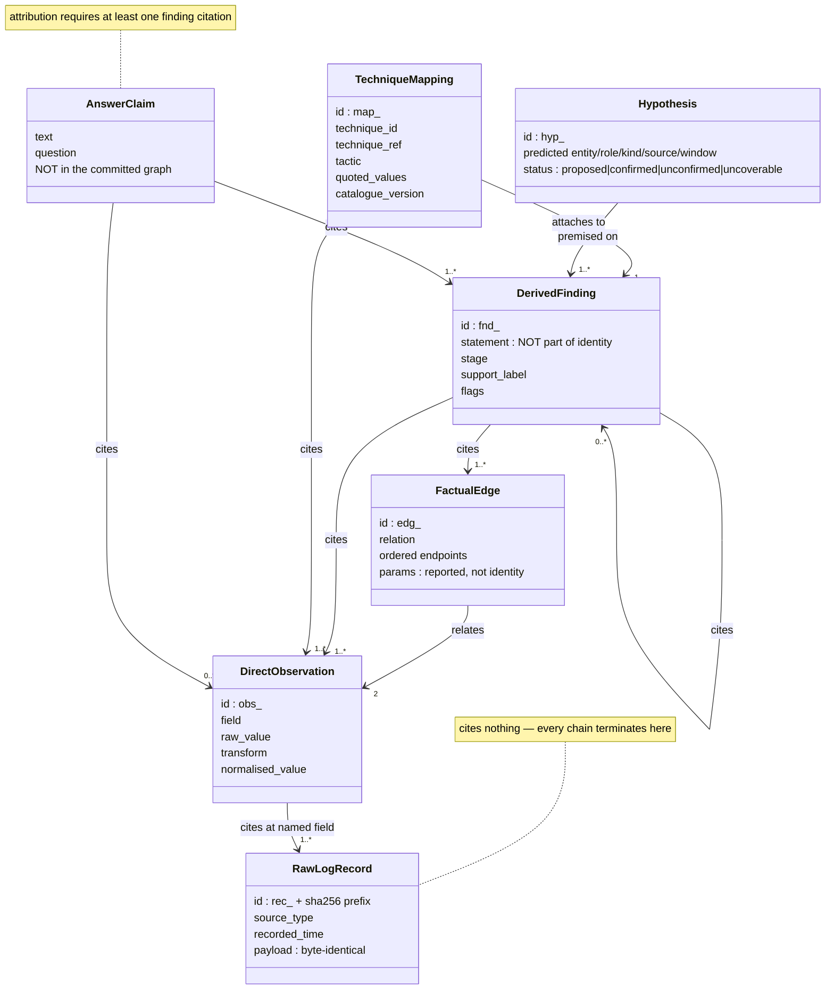
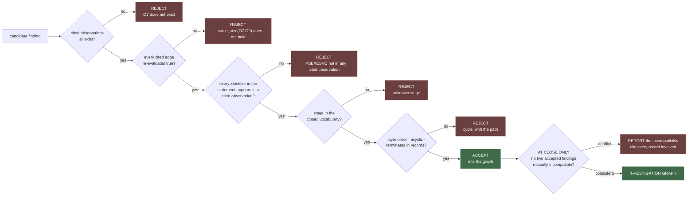

# Architecture diagrams

Four views of the design in [../specs/design.md](../specs/design.md). Mermaid renders on GitHub
and in most Markdown viewers.

---

## 1 · The six-stage pipeline

The assignment names these six stages, and describes the predecessor tool as having had *"no
correlation across sources, no timeline reconstruction, and no connection to known attack
techniques."* Those are exactly stages 3, 5 and 4 — so the pipeline in the brief is an inventory of
what the predecessor lacked.

Every model step is followed by a deterministic gate it cannot bypass.

Note what this makes visible: **`data/attack/` feeds both planes, but the credential exists only in
the build plane.** The app reads committed artifacts and has no path to an outside service, which
is why it runs with the key unset and the network down.

---

## 2 · Inside `correlate` — four layers

The boundary that the whole design turns on: **the deterministic layer emits facts and decides
nothing; the model interprets facts and computes nothing.**

Two consequences worth stating: there is **no coverage ceiling** in the factual layer because
nothing is being detected, and the model **cannot invent a relationship** — only interpret ones
that factually exist.

`temporal_within` **reports** Δ rather than thresholding it, which is why no global time window has
to be chosen. The intrusion's own gaps between related activities span 2 seconds to 2 h 27 min.

---

## 3 · The provenance model

**Five invariants, all machine-decidable — this is the trust story:**

1. **Layer order** — a record cites nothing; an observation cites only records; a finding cites
   observations, findings and edges; a claim cites findings, mappings or observations
2. **Termination** — every chain bottoms out in raw records
3. **Acyclicity** — no node transitively supports itself
4. **Grounding** — every asserted value appears at a named field of a cited record
5. **Normalisation reproducibility** — re-applying a recorded transform to its recorded raw value
   yields the asserted value

---

## 4 · The validation gates

Check 3 does the most work in practice, and it is cheap and total. Check 6 is deferred to close
deliberately: acyclicity and mutual compatibility are **set-level** properties, so two findings can
each be individually valid and jointly inconsistent.

Every rejection carries a **specific** diagnostic, not a boolean — which is what makes the
rejection log a coverage backlog rather than noise, and what the bounded back-prompt feeds on.

---

## What these diagrams deliberately do not claim

The gates validate citations, edges, identifiers, vocabulary and structure. **They do not validate
whether an interpretation is apt.** A finding can cite real observations and real edges, name only
real identifiers, and still conclude wrongly — the test oracle problem, irreducible here. See
§13 of [design.md](../specs/design.md) for the full unsoundness statement.
